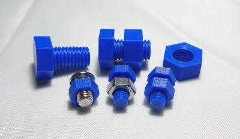
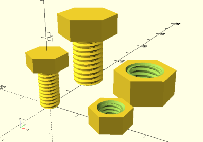
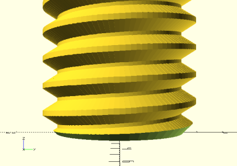
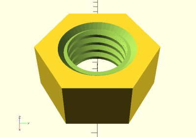

# Simple ISO Thread Module

<table>
<tr>
<td></td>
<td></td>
</tr>
<tr>
<td></td>
<td></td>
</tr>
</table>

A simple, single-file modeled ISO thread module for OpenSCAD. Supports external
threads (bolt) and internal threads (nut) with top and bottom chamfers. CSG
compilation takes a few minutes, but produces functional metric and imperial
threads. The default clearance parameter can be decreased for larger thread
pitches and/or smaller layer heights.

**Module:** [simple_iso_thread.scad](simple_iso_thread.scad)

**Example:** [example.scad](example.scad)

**Example STLs:**

* [m6-1x12-bolt.stl](stl/m6-1x12-bolt.stl)
* [m6-1-nut.stl](stl/m6-1-nut.stl)
* [m10-1.5x16-bolt.stl](stl/m10-1.5x16-bolt.stl)
* [m10-1.5-nut.stl](stl/m10-1.5-nut.stl)

**Recommended Print Settings:** 0.20mm layer height, no supports

**License**: 
